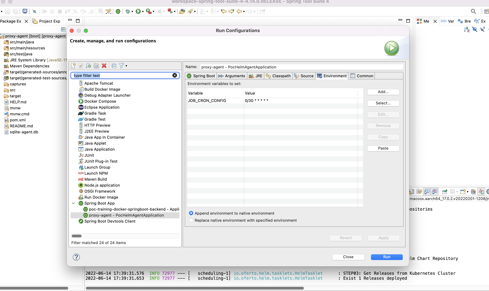

## Description
PoC Helm Agent is a scheduled spring-boot job that update your Kubernete releases to the last version.

## Dependencies

To add a chart repository we must execute:

```shell
helm repo add chartmuseum http://localhost:8088
```

To install helm visit the [official Helm site](https://helm.sh/docs/intro/install/)

## Configuration

Agent environment variables:

- **HELM_COMMAND**: helm binary command. **Default**: /opt/homebrew/bin/helm
- **HELM_REPO**: helm package repository. **Default**: chartmuseum
- **JOB_CRON_CONFIG**: Scheduled Job Cron configuration. **Default**: 0 0/1 * * * *


